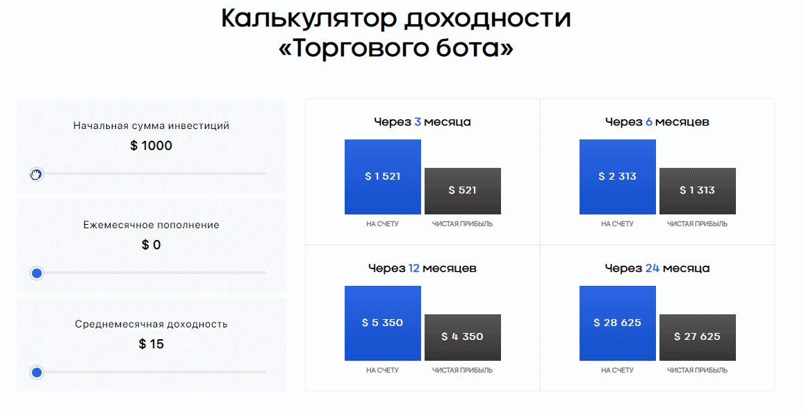

# The "Trading Bot" profitability calculator
[ React, Sass, Webpack ]

<a href="https://codesandbox.io/s/determined-wind-4tw56">
</a>




## Install 
 

Into head:
```html
<link rel="stylesheet" href="https://cdn.jsdelivr.net/gh/vaniljs/Calc_Trading_Bot_Profit@master/dist/style.min.css">
```
 

Before ‹/body›:

```html
<link rel="stylesheet" href="<script src="https://cdn.jsdelivr.net/gh/vaniljs/Calc_Trading_Bot_Profit@master/dist/script.min.js"></script>">
```
 

Target block:

```html
<div id="calcTradingBot"></div>
```
 

Fast template:

```html
<!DOCTYPE html>
<html lang="ru">
<head>
    <meta charset="UTF-8">
    <meta http-equiv="X-UA-Compatible" content="IE=edge">
    <meta name="viewport" content="width=device-width, initial-scale=1.0">
    <title>Document</title>
    <link rel="stylesheet" href="https://cdn.jsdelivr.net/gh/vaniljs/Calc_Trading_Bot_Profit@master/dist/style.min.css"></script>
    <link rel="stylesheet" href="style.min.css">
</head>
<body>

<h1>Калькулятор доходности «Торгового бота»</h1>
<div id="calcTradingBot"></div>

<link rel="stylesheet" href="https://cdn.jsdelivr.net/gh/vaniljs/Calc_Trading_Bot_Profit@master/dist/script.min.js"></script>
</body>
</html>
``` 